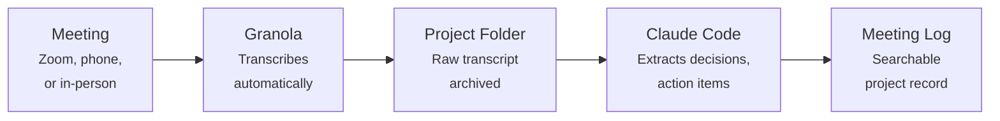

# Meeting Transcription

No Claude Code required

Every meeting generates decisions, action items, and context that live in people's heads and die there. A transcription tool turns all of that into a searchable, actionable record.

**My current tool: [Granola](https://www.granola.ai).** Works on Zoom calls, phone calls, and in-person meetings (phone in your pocket). Transcribes everything, provides AI summaries, and gives you the raw transcript for your own analysis.

!!! note "Alternatives work too"
    Otter.ai, Fireflies.ai, tl;dv, and Zoom's built-in transcription all do good work. I chose Granola for its in-person recording, raw transcript export, and Claude Code integration. See [alternatives](#alternatives) below.

---

## What Granola Does

| Feature | Details |
|---------|---------|
| **Zoom meetings** | Transcribes automatically. No bot joins — works locally. |
| **Phone calls** | Records and transcribes via your phone's microphone. |
| **In-person meetings** | Phone in your pocket. Records ambient audio and transcribes. |
| **AI summaries** | Structured summaries with key topics, decisions, and action items. |
| **Raw transcripts** | Full word-for-word transcript for export. |

**Cost:** ~$10/month. Available on Mac, Windows, and iOS.

**Limitation:** Granola doesn't reliably identify individual speakers. For 2-3 people it's usually obvious from context. For larger meetings, it's a real limitation.

---

## How I Use It

**Without Claude Code:** Granola works fine standalone — you get a transcript and AI summary after every meeting. That alone is a huge upgrade over no transcription.

**With Claude Code:** Feed raw transcripts to Claude Code, extract specific information (*"What decisions were made about the survey instrument?"*), and append results to the project's meeting log.

**Over time,** project meeting logs become searchable institutional memory: *"When did we decide to drop the third treatment arm?" "What open questions have we been discussing since October?"* Especially valuable for distributed teams across time zones.

---

## Alternatives

| Tool | Price | Notes |
|------|-------|-------|
| [**Otter.ai**](https://otter.ai/) | $10-20/mo | Strong speaker identification. Good Zoom integration. |
| [**tl;dv**](https://tldv.io/) | Free-$20/mo | Records Zoom and Google Meet. Good free tier. |
| **Zoom's built-in transcription** | Included | Basic but free. No in-person or phone support. |
| [**Notion AI**](https://www.notion.com/product/ai) | Part of Notion | Good if already in Notion. Less standalone utility. |
| [**Rev**](https://www.rev.com/) | Pay-per-minute | Human transcription. Higher accuracy, higher cost. |

Any transcription tool is a massive improvement over no transcription.

---

## Getting Started

1. **Sign up** at [granola.ai](https://www.granola.ai/)
2. **Install the Mac app** for Zoom transcription
3. **Install the phone app** for calls and in-person meetings
4. **Try it on your next meeting** — review the transcript and summary afterward
5. **Optional:** Set up a transcript export workflow to feed into Claude Code (see [MCP Setup](../toolkit/mcp-setup.md))

The setup is straightforward. The habit of reviewing and processing transcripts after meetings is what generates the real value.
