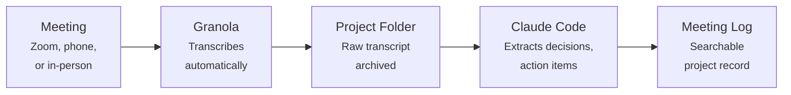

# Meeting Transcription

No Claude Code required

Every meeting generates decisions, action items, and context that live in people's heads and die there. A transcription tool turns all of that into a searchable, actionable record.

**My current tool: [Granola](https://www.granola.ai).** It works on Zoom calls, phone calls, and in-person meetings (phone in your pocket). It transcribes everything, provides AI summaries, and — critically — gives you the raw transcript so you can do your own analysis.

!!! note "Alternatives work too"
    Otter.ai, Fireflies.ai, tl;dv, and Zoom's built-in transcription all do good work. What matters is the capability — transcribing every meeting — not the specific product. I chose Granola for its in-person recording, raw transcript export, and easy integration with Claude Code. See [alternatives](#alternatives) below and pick what fits your workflow.

---

## Why Meeting Transcription Matters

Meetings generate decisions, action items, and context that live in people's heads and die there. A transcription tool turns every meeting into a searchable, actionable record.

**The before:** After a meeting, you have scattered notes and half-remembered commitments. A week later, you're arguing about what was decided.

**The after:** Every meeting produces a transcript and structured summary. Decisions are documented. Action items are extracted. Context is preserved for anyone who wasn't in the room.

---

## What Granola Does

| Feature | Details |
|---------|---------|
| **Zoom meetings** | Transcribes automatically when you join a Zoom call. No bot joins the meeting — it works locally. |
| **Phone calls** | Records and transcribes phone calls (with your phone's microphone). |
| **In-person meetings** | Put your phone in your pocket. Granola records ambient audio and transcribes. |
| **AI summaries** | Generates structured summaries with key topics, decisions, and action items. |
| **Raw transcripts** | Full word-for-word transcript available for export. |
| **Multilingual** | Handles meetings in multiple languages. |

**Cost:** ~$10/month.

**Limitation:** Granola doesn't reliably identify individual speakers. You'll see the words but not always who said them. For meetings with 2-3 people this is usually obvious from context. For larger meetings, it's a real limitation.

---

## How I Use It

### The Basic Flow

A 60-minute meeting becomes a structured project record in about 2 minutes of post-processing.

### Without Claude Code

Granola works fine standalone. You get a transcript and AI summary after every meeting. That alone is a huge upgrade over no transcription. The Claude Code integration below is what turns it into a project management tool.

### With Claude Code

This is where Granola becomes powerful. Instead of just reading summaries, I feed raw transcripts to Claude Code:

1. Export the transcript to a project folder
2. Ask Claude Code to extract specific information: *"What decisions were made about the survey instrument? What action items did each person commit to?"*
3. Append the results to the project's meeting log

### Building a Meeting History

Over time, project meeting logs become searchable institutional memory:

- *"When did we decide to drop the third treatment arm?"*
- *"What did the field team report about attrition in the last three meetings?"*
- *"What open questions have we been discussing since October?"*

This is especially valuable for projects with distributed teams across time zones, where not everyone attends every meeting.

---

## Alternatives

| Tool | Price | Notes |
|------|-------|-------|
| [**Otter.ai**](https://otter.ai/) | $10-20/mo | Strong speaker identification. Good Zoom integration. More meeting-focused than Granola. |
| [**tl;dv**](https://tldv.io/) | Free-$20/mo | Records Zoom and Google Meet with AI summaries. Good free tier. |
| **Zoom's built-in transcription** | Included with Zoom | Basic but free. No in-person or phone support. |
| [**Notion AI**](https://www.notion.com/product/ai) | Part of Notion subscription | Good if you're already in Notion. Less standalone utility. |
| [**Rev**](https://www.rev.com/) | Pay-per-minute | Human transcription. Higher accuracy, much higher cost. Good for critical recordings. |

Granola's advantage for my workflow is the combination of in-person recording, raw transcript export, and integration with Claude Code. But any transcription tool is a massive improvement over no transcription.

**Availability:** Granola works on Mac, Windows, and iOS. It's available globally, though transcription quality is strongest in English. There are no geographic restrictions as of early 2026.

---

## Getting Started

1. **Sign up** at [granola.ai](https://www.granola.ai/)
2. **Install the Mac app** for Zoom transcription
3. **Install the phone app** for calls and in-person meetings
4. **Try it on your next meeting** — review the transcript and summary afterward
5. **Optional:** Set up a transcript export workflow to feed into Claude Code (see [MCP Setup](../toolkit/mcp-setup.md))

The setup is straightforward. The habit of reviewing and processing transcripts after meetings is what takes practice — and what generates the real value.
