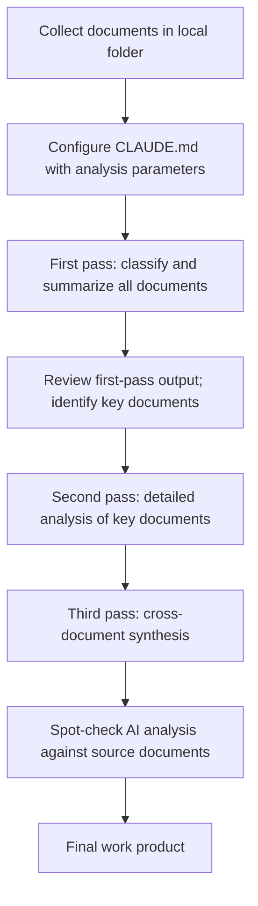

# Document Analysis

<span class="badge-teal">Best with Claude Code</span>

Lawyers spend enormous amounts of time reading documents -- discovery productions, due diligence data rooms, regulatory filings, deposition transcripts, contract portfolios. The work is essential, but much of it is mechanical: finding the relevant passages, identifying patterns across documents, flagging inconsistencies, and organizing findings into a useful structure.

AI is well suited to the mechanical parts of document analysis. Claude Code, in particular, can read files directly from your computer, which means sensitive documents never need to be uploaded to a cloud service. This page covers how to use AI for large-scale document analysis, with practical examples and clear guidance on when AI analysis is appropriate and when manual review is required.

!!! info "Why Claude Code for document analysis"

    Claude Code reads files from your local machine. When you point it at a folder of contracts, deposition transcripts, or discovery documents, it processes them locally and sends text to Claude's API for analysis. This means the documents do not need to be uploaded to a web interface, copied into a chat window, or shared with a third-party platform. For sensitive legal documents, this is a meaningful advantage.

---

## What AI Does Well in Document Analysis

AI excels at tasks that require reading large volumes of text and extracting structured information:

- **Summarization** -- distilling long documents into key points, organized by topic or chronology
- **Pattern identification** -- finding recurring terms, clauses, or provisions across a set of documents
- **Consistency checking** -- comparing documents against each other to identify conflicts, contradictions, or deviations
- **Information extraction** -- pulling specific data points (dates, amounts, parties, obligations) from documents
- **Classification** -- sorting documents into categories based on content
- **Cross-referencing** -- identifying relationships between documents (e.g., which contracts reference which exhibits)
- **Timeline construction** -- building chronologies from documents with different dates and events

---

## Example: Analyzing a Set of Contracts for Consistency

You represent a company that has 50 vendor agreements, each negotiated separately over three years. The general counsel wants to know: Are our indemnification terms consistent across vendors? Which agreements have non-standard limitation of liability provisions? Which are missing data protection clauses?

### Step 1: Organize the Files

```
vendor-agreements/
  CLAUDE.md
  contracts/
    vendor-001-acme.pdf
    vendor-002-globex.pdf
    vendor-003-initech.pdf
    ... (50 files)
  analysis/
    [Output will go here]
```

### Step 2: Configure the CLAUDE.md

```markdown
# Vendor Agreement Analysis

## Task
Analyze the vendor agreements in contracts/ for consistency across
key terms.

## Key Terms to Track
For each agreement, extract:
1. Indemnification: scope, caps, carve-outs, mutual vs. one-way
2. Limitation of liability: cap amount or formula, exclusions, consequential
   damages waiver
3. Data protection: presence/absence, CCPA/GDPR compliance, breach
   notification requirements
4. Term and termination: duration, auto-renewal, termination for
   convenience, termination for cause
5. Assignment: consent required? change of control provisions?
6. Governing law and dispute resolution

## Output Format
- Per-agreement summary: one row per agreement in a comparison table
- Cross-agreement analysis: identify outliers, missing provisions,
  and non-standard terms
- Risk summary: top 10 agreements by risk level, with explanation
- Save all output to analysis/ folder

## Standards
- "Standard" means: mutual indemnification with reasonable cap,
  limitation of liability at 12 months of fees, basic data protection
  terms, 30-day termination for convenience
- Flag anything that deviates from these standards
```

### Step 3: Run the Analysis

```text
Read all 50 vendor agreements in contracts/ and produce the analysis
described in CLAUDE.md. Start with the comparison table, then the
cross-agreement analysis, then the risk summary.

For each agreement, note:
- The vendor name and agreement date
- Whether each key term is present, absent, or non-standard
- For non-standard terms, quote the specific language and explain
  the deviation

Save the comparison table as analysis/comparison-table.md and the
full analysis as analysis/full-report.md.
```

Claude Code will read through all 50 agreements, extract the relevant provisions, and produce a structured comparison. This is work that would take a junior associate days; AI does it in minutes.

!!! warning "Verify the output"

    AI may misclassify a provision, miss a clause that is worded unusually, or misinterpret an ambiguity. After the AI produces its analysis, spot-check at least 10-20% of the agreements manually. Focus on any agreements the AI flagged as "standard" -- these are the ones where a missed issue would go unnoticed.

---

## Example: Summarizing Deposition Transcripts

Deposition transcripts are long, repetitive, and essential. AI can extract the substance without requiring you to re-read 300 pages for every motion.

```text
Read the deposition transcript at depositions/smith-depo-2025-03-15.pdf.

Produce:
1. WITNESS SUMMARY (1 paragraph)
   - Who the witness is, their role, and their relationship to the matter

2. KEY TESTIMONY (organized by topic)
   - For each substantive topic covered in the deposition:
     - Topic heading
     - Summary of the witness's testimony (2-3 sentences)
     - Key quotes with page:line citations
     - Any admissions or statements that could be used against
       this witness

3. CONTRADICTIONS AND INCONSISTENCIES
   - Any places where the witness contradicted themselves
   - Any testimony that conflicts with [other evidence or prior
     statements, if provided]

4. AREAS NOT COVERED
   - Topics I should consider covering in a follow-up deposition
     or through other discovery

5. TIMELINE
   - A chronological list of events the witness described, with
     page:line references

Cite to page:line for every factual assertion. I need to be able
to find the testimony in the transcript quickly.
```

### Batch Deposition Analysis

When you have multiple depositions in a case, the cross-deposition analysis is where AI adds the most value:

```text
Read all deposition transcripts in depositions/ and produce:

1. A master timeline of events, synthesized from all witnesses,
   with conflicting accounts noted
2. A comparison of key testimony -- where do witnesses agree and
   disagree on the critical facts?
3. A credibility assessment noting internal contradictions, vague
   answers, and refusals to answer
4. A list of factual disputes that will need to be resolved at trial

For every factual claim, cite the witness and page:line. When
witnesses disagree, present both versions side by side.
```

---

## Structuring Analysis with Clear Prompts

The quality of document analysis depends heavily on the specificity of your prompt. Vague instructions produce vague output. Here are principles for effective document analysis prompts:

### Be Specific About What to Extract

| Vague | Specific |
|-------|----------|
| "Summarize this contract" | "Extract the indemnification terms, limitation of liability, and termination provisions from this contract" |
| "Review these documents" | "For each document, identify the date, parties, subject matter, and any obligations with deadlines" |
| "Analyze the deposition" | "List every factual claim the witness made about the events of March 15, with page:line citations" |

### Define the Output Format

Tell AI exactly how you want the results structured:

```text
Output as a markdown table with columns:
| Document | Date | Parties | Key Obligation | Deadline | Risk Flag |
```

Or:

```text
For each document, produce a structured summary:
- DOCUMENT: [filename]
- TYPE: [contract / letter / memo / filing]
- DATE: [date]
- KEY FINDINGS: [3-5 bullet points]
- ACTION ITEMS: [anything requiring follow-up]
- RISK LEVEL: [HIGH / MEDIUM / LOW with one-sentence explanation]
```

### Use Iterative Analysis

For large document sets, work in stages:

1. **First pass: classification and summary.** Have AI read all documents and produce a one-line summary of each. Review this list to identify the most important documents.

2. **Second pass: detailed analysis.** Focus AI's detailed analysis on the documents that matter most. This is more efficient than analyzing every document in equal depth.

3. **Third pass: cross-document synthesis.** Once you have detailed analyses of the key documents, ask AI to synthesize patterns, contradictions, and themes across the set.

---

## Privacy Considerations for Document Analysis

Document analysis often involves the most sensitive materials in a legal matter. Here is a framework for deciding how to handle document analysis with AI:

| Document Type | Sensitivity | Recommended Approach |
|--------------|------------|---------------------|
| **Public filings** (SEC, court records) | Low | Any tool; information is already public |
| **Standard commercial contracts** | Medium | Claude Code with local files preferred; chatbot acceptable if terms are not confidential |
| **Privileged communications** | High | Claude Code with local files only; review data handling policies |
| **Discovery materials** | High | Claude Code with local files only; consider protective order terms |
| **Client financial records** | High | Claude Code with local files only; never paste into consumer chatbot |
| **Medical records** | Very high | Claude Code with local files; HIPAA considerations; consult your compliance team |
| **Trade secrets** | Very high | Claude Code with local files only; consider whether any AI analysis is appropriate |

!!! danger "Protective Orders and Confidentiality Agreements"

    If documents are subject to a protective order or confidentiality agreement, review those terms before using any AI tool for analysis. Some protective orders restrict the use of "automated processing" or require that documents not be shared with "third-party services." AI processing may implicate these restrictions. When in doubt, seek clarification from the court or the producing party.

### Data Handling with Claude Code

When Claude Code analyzes documents on your machine:

1. **The documents stay on your machine.** Claude Code reads files locally.
2. **Text is sent to Claude's API for processing.** The content of the documents is transmitted to Anthropic's servers for AI analysis.
3. **Anthropic's data retention policies apply.** Review these policies before processing sensitive documents.

For the most sensitive materials, consider:

- Processing documents in segments rather than whole files
- Redacting identifying information before analysis
- Using AI only for structural analysis (extracting dates, identifying document types) rather than substantive analysis that requires the full text
- Consulting your firm's data governance team

---

## When AI Document Analysis Is Appropriate vs. When Manual Review Is Required

AI document analysis is appropriate when:

- You need a **first-pass review** to identify the most relevant documents in a large set
- You are looking for **specific information** (dates, amounts, clause types) across many documents
- You need to **organize and categorize** a document collection
- You want to **identify patterns** that would be difficult to see document by document
- Time pressure requires **rapid analysis** that manual review cannot achieve

Manual review is required when:

- **Privilege determination** -- deciding whether a document is privileged requires legal judgment that AI cannot provide reliably
- **Relevance decisions for production** -- deciding what to produce in discovery involves strategic considerations AI does not understand
- **Credibility assessment** -- reading a deposition transcript for demeanor cues, evasiveness, or nuance requires human judgment
- **Novel legal issues** -- when the significance of a document depends on a legal question AI may not understand
- **Final verification** -- AI analysis is a first pass; the final determination of any important factual or legal issue must be made by a human
- **Documents with unusual formatting** -- handwritten notes, heavily redacted documents, poor-quality scans, and documents in uncommon formats may not be read accurately by AI

---

## A Practical Document Analysis Workflow



### Folder Structure

```
document-analysis/
  CLAUDE.md                    # Analysis configuration and standards
  source-documents/
    [Original documents organized by source or type]
  analysis/
    first-pass-summary.md      # Classification and one-line summaries
    detailed-analysis.md       # In-depth analysis of key documents
    synthesis.md               # Cross-document themes and findings
    timeline.md                # Chronological event reconstruction
    issues-list.md             # Open questions and items for follow-up
```

### Verification Protocol

After AI completes its analysis:

- [ ] **Spot-check 15-20% of documents** against the AI's summaries. Focus on documents flagged as "low relevance" (where AI might have missed something) and documents flagged as "high risk" (where accuracy matters most).
- [ ] **Verify quoted text.** If the AI quotes from documents, check at least a sample of quotes against the originals to confirm accuracy.
- [ ] **Check for completeness.** Confirm that every document in the folder was processed. AI may skip files it cannot read (corrupted PDFs, image-only scans, unusual formats).
- [ ] **Review the "not found" list.** If AI reports that certain information was not found in the documents, confirm this with a manual search before relying on the negative finding.
- [ ] **Validate the timeline.** If AI constructed a timeline, check key dates and events against the source documents.

---

## Ethics Considerations for AI Document Analysis

!!! danger "Model Rules 1.1 and 1.6: Competence and Confidentiality"

    Document analysis often involves the most sensitive materials in a legal matter. The duty of competence requires that you understand how AI processes these materials and what happens to the data. The duty of confidentiality requires that you take reasonable steps to protect client information from unauthorized disclosure. Using AI for document analysis is permissible, but requires deliberate choices about tools, data handling, and verification.

**Proportionality.** AI document analysis is most valuable -- and most appropriate -- when the volume of documents makes manual review impractical. For a small set of critical documents, manual review may be both more appropriate and more reliable.

**Supervision.** If you are delegating document analysis to AI, apply the same supervisory standards you would apply to a paralegal or contract attorney performing the same task. Review the methodology, spot-check the results, and take responsibility for the final work product.

**Transparency.** In some contexts (particularly discovery), you may need to disclose your methodology for document review. Consider whether your use of AI should be disclosed to opposing counsel or the court, particularly if it affects the completeness of your review.

---

## Next Steps

<div class="grid cards" markdown>

-   **Try a small-scale analysis**

    ---

    Take 5-10 documents from a current matter. Set up the folder structure, write a CLAUDE.md, and run a first-pass analysis. Compare the results to what you already know about the documents.

-   **Build a deposition summary template**

    ---

    Using the deposition prompt above, create a reusable template for deposition summaries. Run it on a transcript you have already reviewed and compare the AI's output to your own notes.

-   **Review your data handling policies**

    ---

    Before analyzing sensitive documents with any AI tool, confirm that your approach is consistent with your firm's data governance policies, any applicable protective orders, and your obligations under the rules of professional conduct.

</div>

---

## Related Pages

- [Legal Research](legal-research.md) -- AI-assisted research using documents you have collected
- [Contract Review](contract-review.md) -- Focused analysis of individual contracts
- [MCP Connections](../toolkit/mcp-setup.md) -- Setting up Claude Code to access your local files
- [Your CLAUDE.md](../toolkit/claude-md.md) -- Configuring Claude Code for your workflow
