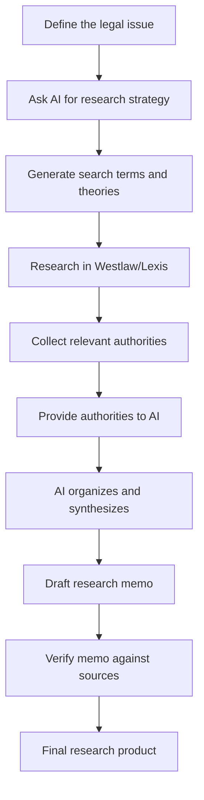

# Legal Research

<span class="badge-teal">Works in chatbots and Claude Code</span>

Legal research is the foundation of every other legal workflow -- contracts, briefs, client advice, and deal structuring all depend on knowing the law. AI can accelerate parts of the research process, but it cannot replace authoritative legal databases, and understanding its limitations is essential before you rely on it.

This page covers what AI can and cannot do for legal research, how to combine AI tools with traditional research platforms, and the practical workflows that get the best results.

!!! warning "AI is not a legal database"

    AI models do not have access to Westlaw, Lexis, or any other legal database. They cannot tell you what the law *is* with the reliability of a primary source lookup. They can help you *think about* the law, *organize* your research, and *identify leads* -- but every proposition of law must be verified in an authoritative source.

---

## What AI Can Do for Legal Research

AI is useful at specific research tasks. Understanding which tasks it handles well -- and which it handles poorly -- is the key to using it effectively.

**AI does well:**

- Summarizing cases, statutes, or regulatory provisions that you provide to it
- Explaining legal concepts in plain language
- Identifying the elements of a legal claim or defense
- Suggesting search terms and research strategies
- Comparing legal standards across jurisdictions (with verification)
- Structuring research memos from materials you supply
- Generating hypotheses about what law might apply to a novel fact pattern
- Identifying potential counterarguments to a legal position

**AI does poorly:**

- Citing specific cases (it will fabricate them)
- Reporting current law (training data has a cutoff date)
- Accessing proprietary databases (Westlaw, Lexis, Bloomberg Law)
- Evaluating precedential weight (binding vs. persuasive authority)
- Tracking subsequent history (overruled, distinguished, limited)
- Identifying the most recent version of a statute or regulation

---

## Two AI Tools, Two Research Roles

The AI tools covered in this guide serve different research functions. Understanding the distinction helps you choose the right tool for each task.

### ChatGPT Deep Research

ChatGPT's Deep Research feature (available with a ChatGPT Plus or Pro subscription) can browse the web in real time. This makes it useful for:

- **Broad legal questions.** "What states have adopted the Uniform Electronic Transactions Act?" -- Deep Research can search for this and provide a current list with sources.
- **Regulatory landscape surveys.** "What are the current federal regulations governing telehealth prescribing?" -- it can pull from government websites and recent news.
- **Finding secondary sources.** Law review articles, bar journal pieces, CLE materials, and other secondary sources that are publicly available on the web.
- **Current events and recent developments.** Legislative changes, recent high-profile decisions, regulatory proposals.

!!! tip "Deep Research provides URLs"

    Unlike standard AI chat, Deep Research provides links to the sources it found. Always click through to the source and verify the information. The links are usually real, but the AI's summary of what they say may be imprecise.

### Claude for Structured Analysis

Claude (in Claude.ai or Claude Code) does not browse the web, but it excels at analyzing documents you provide to it:

- **Case analysis.** Paste a case opinion into Claude and ask it to summarize the holding, identify the rule, extract the key facts, or compare it to another case.
- **Statute parsing.** Paste a statutory section and ask Claude to break down its elements, explain ambiguities, or identify interpretive questions.
- **Research memo drafting.** Provide Claude with a set of cases and statutes you have already found, and ask it to organize them into a structured research memo.
- **Argument development.** Describe a legal issue and ask Claude to identify the strongest arguments on both sides, the relevant legal standards, and the factual issues that would be dispositive.

```text
I am researching whether [legal issue] in [jurisdiction].

Here are the relevant materials I have found:

<case_1>
[Paste case text or summary]
</case_1>

<case_2>
[Paste case text or summary]
</case_2>

<statute>
[Paste statutory text]
</statute>

Based on these materials:
1. What is the current legal standard in [jurisdiction]?
2. How have courts applied this standard to facts similar to mine?
3. What are the strongest arguments for [our position]?
4. What are the strongest counterarguments?
5. Are there gaps in my research -- issues I should investigate further?

Cite only to the materials I have provided. Do not invent additional
citations. If you believe additional research is needed, tell me what
to search for, but do not fabricate sources.
```

---

## MCP Connections for Your Document Library

If you use Claude Code with MCP (Model Context Protocol) connections, you can give Claude access to your own document library -- case files, research memos, saved opinions -- without uploading anything to the cloud.

This is covered in detail in the [MCP Connections](../toolkit/mcp-setup.md) setup guide. The key idea for legal research: if you maintain a local folder of cases, statutes, and research memos, Claude Code can search and analyze that library directly.

```text
Search my research folder at ~/legal-research/employment-law/ for
any cases discussing the standard for constructive discharge in
[jurisdiction]. Summarize what you find and identify any conflicts
in the case law.
```

This is particularly valuable for:

- Returning to a research project after weeks or months away
- Cross-referencing cases across multiple matters
- Building on prior research without re-reading everything from scratch
- Identifying patterns across a body of case law you have collected

---

## Best Practices for AI-Assisted Legal Research

### 1. Use AI to Generate Leads, Not Conclusions

The most effective pattern: ask AI to suggest what to research, then do the research yourself in authoritative sources.

```text
I represent a plaintiff in a product liability case involving a
defective medical device in [jurisdiction]. The device was implanted
in 2022 and failed in 2024. What legal theories should I research?
For each theory, give me specific search terms I should use in
Westlaw and the key cases or statutes I should look for.

Do NOT cite specific cases -- I will find them myself. Just tell me
what to search for and what legal standards I should expect to find.
```

This avoids the hallucination problem entirely while still leveraging AI's ability to survey a legal landscape quickly.

### 2. Verify Everything in Authoritative Sources

This cannot be stated too often. For every proposition of law that AI suggests:

- Find the actual case or statute in Westlaw, Lexis, or an official source
- Read the relevant portion yourself
- Check the subsequent history (KeyCite, Shepard's)
- Confirm the authority is binding in your jurisdiction

### 3. Use AI to Organize, Not to Discover

AI is better at organizing research you have already done than at discovering new authorities. Once you have a collection of cases and statutes from your own research, use AI to:

- Sort authorities by relevance to your specific issue
- Identify themes and patterns across a body of case law
- Draft a research memo that synthesizes your findings
- Spot gaps in your research that you should fill

### 4. Maintain a Research Log

Keep a record of what you searched, where you searched, and what you found. This is good practice regardless of AI use, but it becomes essential when AI is part of your workflow because:

- It helps you distinguish between what AI suggested and what you verified
- It creates a record for supervisors or partners who may ask about your process
- It protects you if opposing counsel questions the reliability of your research

---

## Comparative Table: AI Research vs. Traditional Tools

| Task | AI (ChatGPT / Claude) | Westlaw / Lexis | Best Approach |
|------|----------------------|-----------------|---------------|
| **Find a specific case by name** | Unreliable -- may fabricate details | Reliable | Traditional tools |
| **Survey legal landscape on a topic** | Good starting point; needs verification | Comprehensive but time-intensive | AI for initial survey, then verify in traditional tools |
| **Summarize a case you already have** | Excellent when given the full text | Not needed (you have the case) | AI |
| **Check if a case is still good law** | Cannot do this reliably | KeyCite / Shepard's | Traditional tools only |
| **Identify elements of a claim** | Good for well-established claims | Secondary sources are authoritative | AI for quick reference; verify for novel claims |
| **Compare standards across jurisdictions** | Good for general comparison; needs verification | Comprehensive and reliable | AI for initial comparison; verify specifics |
| **Draft a research memo** | Excellent at organizing and synthesizing materials you provide | N/A | AI, with your verified materials as input |
| **Find secondary sources** | ChatGPT Deep Research can find publicly available articles | Westlaw / Lexis have comprehensive secondary source libraries | Both -- AI for public sources, traditional for comprehensive coverage |
| **Identify relevant search terms** | Very useful for generating creative search strategies | Boolean search requires you to know the terms | Start with AI, refine in traditional tools |
| **Track legislative changes** | ChatGPT Deep Research can find recent news | Legislative tracking tools are more reliable | Traditional tools for critical matters; AI for awareness |

---

## A Practical Research Workflow

Here is a workflow that combines AI and traditional tools effectively:



**Step 1: Define the issue.** Write a clear statement of the legal question.

**Step 2: Ask AI for a research strategy.** Use the "generate leads, not conclusions" prompt above. Get search terms, legal theories, and a sense of the landscape.

**Step 3: Research in authoritative sources.** Take the AI-generated leads into Westlaw or Lexis. Run your searches. Find real cases and statutes.

**Step 4: Feed verified materials back to AI.** Paste your found authorities into Claude and ask it to organize, synthesize, and identify gaps.

**Step 5: Draft with AI assistance.** Use the organized materials to draft a research memo or the research section of a brief.

**Step 6: Verify the final product.** Every citation, every legal standard, every factual claim in the final product must be traceable to an authoritative source you verified yourself.

---

## Limitations You Must Understand

| Limitation | Practical Impact | Your Mitigation |
|-----------|-----------------|-----------------|
| **Training data cutoff** | AI does not know about law enacted or cases decided after its training cutoff. Claude's cutoff is currently early 2025; ChatGPT varies by model. | Always check for recent developments in traditional databases |
| **No access to legal databases** | AI cannot search Westlaw, Lexis, or other proprietary databases | Use AI for strategy and synthesis; use databases for authority |
| **Citation fabrication** | AI will invent case names, citations, and holdings that do not exist | Never use an AI-generated citation without verifying it in an authoritative source |
| **Jurisdiction confusion** | AI may conflate standards from different jurisdictions or apply federal law when state law governs | Always specify the jurisdiction and verify that authorities are binding |
| **Incomplete analysis** | AI may miss relevant authorities, especially recent or niche cases | Treat AI research as a starting point, not a complete survey |
| **Overconfidence** | AI presents uncertain information with the same confidence as well-established law | Verify everything; do not mistake confident tone for accuracy |

---

## Ethics Considerations for AI-Assisted Legal Research

!!! danger "Model Rule 1.1: Competence"

    The duty of competence requires that you understand the limitations of your research tools. Relying on AI-generated citations without verification is not just risky -- it is a competence failure. The standard of care requires that you verify the existence and accuracy of every authority you cite.

**Thoroughness.** AI-assisted research can give a false sense of completeness. Because AI provides well-organized, confident-sounding summaries, it is easy to feel that your research is thorough when it may have significant gaps. Always ask: "What might I be missing?" and do supplementary research in traditional databases.

**Supervision.** If you are supervising junior attorneys or law students who use AI for research, establish clear protocols. Require them to verify every AI-generated lead. Review their research logs. Make the verification step a non-negotiable part of your research process.

**Billing.** Time spent on AI-assisted research may be significantly less than traditional research. Bill ethically and transparently. Some clients may appreciate the efficiency; others may wonder about thoroughness. Be prepared to explain your process.

---

## Next Steps

<div class="grid cards" markdown>

-   **Try the research workflow**

    ---

    Take a legal issue you are currently researching. Use the AI-first strategy to generate leads, then verify in Westlaw or Lexis. Compare the experience to your usual process.

-   **Set up a research folder**

    ---

    Create a local folder for a current research project. Save cases and statutes as files. Use Claude Code to search and synthesize across the collection.

-   **Build your verification habit**

    ---

    Before using AI research in any work product, run through the verification checklist: real case, correct citation, still good law, binding in your jurisdiction.

</div>

---

## Related Pages

- [Brief Drafting](brief-drafting.md) -- Where your research becomes written arguments
- [Document Analysis](document-analysis.md) -- Analyzing large document sets with AI
- [MCP Connections](../toolkit/mcp-setup.md) -- Setting up Claude Code to access your files
