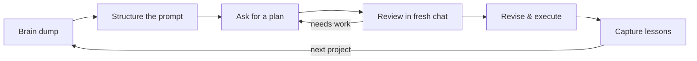

# Prompt, Plan, Review, Revise

The most useful AI technique we have found is not a single tool or feature. It is a loop -- four steps that repeat until the output is genuinely good. We use it for everything from drafting clinic proposals to designing research methodologies to planning faculty workshops.

This page shows the method. Everything here works with a browser-based chatbot (Claude.ai or ChatGPT). If you use Claude Code, the same loop applies -- you just have more powerful tools at each step.

---

## The loop

Most people treat AI interactions as one-shot: type a prompt, get an answer. The loop turns it into a process. Each step exists because the previous one is not enough on its own.

- **Prompt** -- structure your thinking so you are not feeding the AI a vague request
- **Plan** -- ask the AI to think before it acts, producing a plan you can review
- **Review** -- stress-test the plan with fresh eyes (a new chat session that has never seen the conversation)
- **Revise** -- fix what the review found, then capture what you learned for next time



??? quote "Example: Planning a new experiential learning clinic"

    A faculty member wanted to propose a new immigration law clinic to the dean. She had a rough idea -- partner with local legal aid organizations, focus on asylum cases, involve 2L and 3L students -- but had not worked out the details.

    She brain-dumped her idea into Claude, about 200 words of unstructured thinking. Then she asked Claude to restructure it into a proper prompt with role, context, task, and constraints. The restructured version was clearer: it specified that the audience was a skeptical dean, the budget needed to be realistic, and the proposal should address ABA accreditation requirements for clinical programs.

    She put Claude in planning mode -- asking it to outline the proposal before writing anything. The plan included sections she had not thought of: a comparison to peer institution clinics, a student supervision model, and a sustainability plan for when grant funding runs out.

    She did not trust the plan. So she opened a fresh chat and pasted the plan with the stress-test prompt from our [Stress-Test Any Plan](plan-review-browser.md) page. The fresh reviewer found three problems: the supervision ratio was too high for ABA standards, the partnership model assumed the legal aid org had capacity they might not have, and the timeline for the first semester was unrealistic.

    After two rounds of revision, she had a proposal that addressed every concern the review surfaced. The whole process took about two hours -- much less than writing it from scratch, and the result was stronger than her usual first drafts.

---

## Step 1: Structure your thinking

The gap between how we naturally think about a problem and what produces good AI output is large. We tend to be vague, assume context, and skip constraints. The AI needs specifics.

The fix: take your rough, conversational description of what you want and restructure it before giving it to the AI. A good prompt has most of these elements:

| Element | What it does | Example |
|---------|-------------|---------|
| **Role** | Tells the AI what expertise to bring | "You are an experienced appellate attorney" |
| **Context** | Background the AI needs to understand your situation | "I am drafting a cert petition in a Fourth Amendment case" |
| **Task** | The specific thing you want done | "Outline the three strongest arguments for granting certiorari" |
| **Constraints** | Boundaries and requirements | "Focus on circuit splits; do not exceed 2,000 words" |
| **Output format** | How you want the result structured | "Provide each argument as a heading with supporting cases" |
| **Bookend** | A reminder at the end to reinforce key instructions | "Remember: this is for a skeptical clerk, not a sympathetic judge" |

Not every prompt needs all six parts. But knowing them helps you diagnose why a prompt is not working. See the [Prompt Engineering](../essentials/prompting.md) page for the full framework.

!!! tip "Dictation makes this faster"
    You do not need to type structured prompts from scratch. Dictate your rough thinking -- stream of consciousness is fine -- and then ask the AI to restructure it into a proper prompt. The AI is good at this. See [Teaching AI Your Voice](../essentials/voice.md) for more on dictation workflows.

---

## Step 2: Ask for a plan before execution

Do not let the AI jump straight to writing. Ask it to outline a plan first.

This matters because the default behavior of most AI tools is to start producing output immediately. If the first draft goes in the wrong direction, you have wasted time and context. A plan gives you a checkpoint.

**In a browser chatbot:** Simply add to your prompt: *"Before writing anything, outline your approach and wait for my approval."*

**In Claude Code:** Press **Shift+Tab** to enter Plan Mode. Claude can read files and explore your project, but it cannot execute anything until you approve the plan.

**The persona technique:** For complex plans, assign the AI two or more perspectives and ask them to debate before converging. For example: *"Plan this clinic proposal from two perspectives: (1) a clinical law professor focused on pedagogy, and (2) an associate dean focused on budget and accreditation. Have them debate before agreeing on a single plan."*

---

## Step 3: Stress-test with fresh eyes

This is the most important step in the loop.

The AI reviewing its own plan in the same conversation is like asking someone to peer-review their own article. It has seen all the reasoning. It knows why every decision was made. It is structurally incapable of seeing its own blind spots.

The fix: **open a brand new chat** and paste the plan with an adversarial review prompt. The fresh session has never seen the conversation -- it evaluates only what is on the page.

We have a complete guide to this technique: **[Stress-Test Any Plan](plan-review-browser.md)**. That page includes the exact prompt to copy, tips for high-stakes plans, and instructions for saving it as a reusable project.

**Quick version:** Copy your plan, open a fresh chat, paste this at the top:

```text
You are an external reviewer, not a collaborator. Your job is to find
problems, not to encourage. Stress-test this plan. Classify each
finding as MUST FIX or WORTH CONSIDERING. End with a verdict:
PROCEED or REVISE FIRST.
```

Then paste your plan below it.

**For high-stakes work** (briefs, grant applications, tenure materials): Run the review twice with different reviewer personas. *"Review this as opposing counsel"* catches different problems than *"Review this as a junior associate seeing the case for the first time."*

---

## Step 4: Revise and capture

After the review, fix the critical issues and decide consciously which lesser risks you are accepting. Then -- and this is the part most people skip -- **capture what you learned.**

Write a brief note (even just a few bullet points) about:

- What the AI did well and what it missed
- What the review caught that you would not have
- What you would do differently next time
- Any reusable prompts or techniques that worked

This note is your investment in the next session. Without it, every AI interaction starts from zero. With it, you build a personal library of what works for your specific practice area and writing style.

!!! tip "Where to keep these notes"
    A simple text file or note in your preferred app works fine. If you use Claude Code, your `CLAUDE.md` file is the ideal place -- it is loaded automatically at the start of every session. See [Your CLAUDE.md](../toolkit/claude-md.md) for how to set this up.

---

## Putting it together

Here is the loop applied to three common law faculty tasks:

| Task | Prompt | Plan | Review | Capture |
|------|--------|------|--------|---------|
| **Draft a law review article outline** | "You are a legal scholar in [field]. Outline an article arguing [thesis]. Context: [target journal, word limit, audience]." | Ask for section outline with key arguments and sources before writing | Fresh chat: "Review as a law review editor. What is missing? What would a hostile reader say?" | Note which arguments survived review, which were cut, what sources to add |
| **Design a new course** | "You are an experienced law professor. Design a 14-week course on [subject]. Context: [student level, prerequisites, learning objectives]." | Ask for week-by-week schedule with readings and assessments | Fresh chat: "Review as a student who has to take this course. Where will they get lost? Where is the workload unrealistic?" | Note which weeks need rebalancing, what readings to swap |
| **Write a grant proposal** | "You are a grant writer experienced with [funder]. Draft a proposal for [project]. Context: [budget range, timeline, team]." | Ask for proposal structure with budget justification before prose | Fresh chat: "Review as a skeptical grant reviewer. Where are the weaknesses? What would you flag?" | Note which reviewer concerns to address preemptively in the narrative |

---

## What's next

Once this loop feels natural, you have two paths:

- **Stay in the browser** -- The loop works indefinitely with just Claude.ai or ChatGPT. Many of our faculty use nothing else and get excellent results.
- **Move to coding agents** -- If you want AI that can read your files, search databases, and execute multi-step workflows, the [Setup Guide](../setup/index.md) walks you through installing Claude Code. The same loop applies -- you just have more powerful tools at each step.
